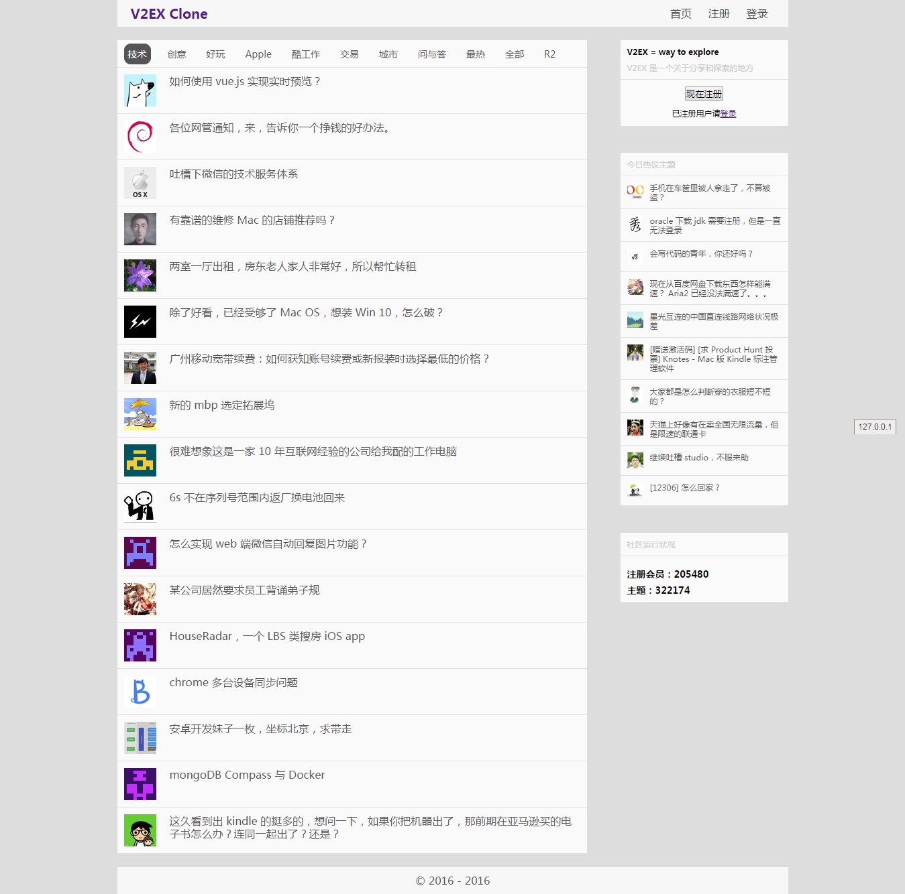

# vue-v2ex

## usage

1. install [Allow-Control-Allow-Origin: *](https://chrome.google.com/webstore/detail/allow-control-allow-origi/nlfbmbojpeacfghkpbjhddihlkkiljbi)
2. `npm install`
3. `npm run dev`

## todo

- 路由
  - 将路由文件提取放到 router 文件夹下，main.js 只需引用而不需要另外设置
  - Index 组件下 tab 页的路由配置
  - 页面初始时的路由配置，以及剩下的遗漏的一些路由设置
  - 思考路由是如何找到渲染的 \<router-view\> 位置的？如果组件没有 \<router-view\> 元素，挑最近的渲染？
  - 思考配置 \<router-link\> 和直接渲染一个 a 标签的区别
- 数据请求
  - 学习 vue-resource 以及官方推荐的 [axios](https://github.com/mzabriskie/axios)
  - 当数据还没请求到时不渲染，而不是渲染空对象（赋值为 null 就报错）
  - loading 动画
- Rigister & Login components
- 主题详情页
- 主题回复组件
- 样式修改、提取等

## bug

- ~~进入帖子详情页（即 Detail component）后，无法点击右侧的「今日热议主题」部分的帖子~~（fixed，用 watch 方法监听路由 $route 的变化，然后更新，需要同时更新 Detail 的子组件 Reply，思考是否可以一次更新完？）

## preview

